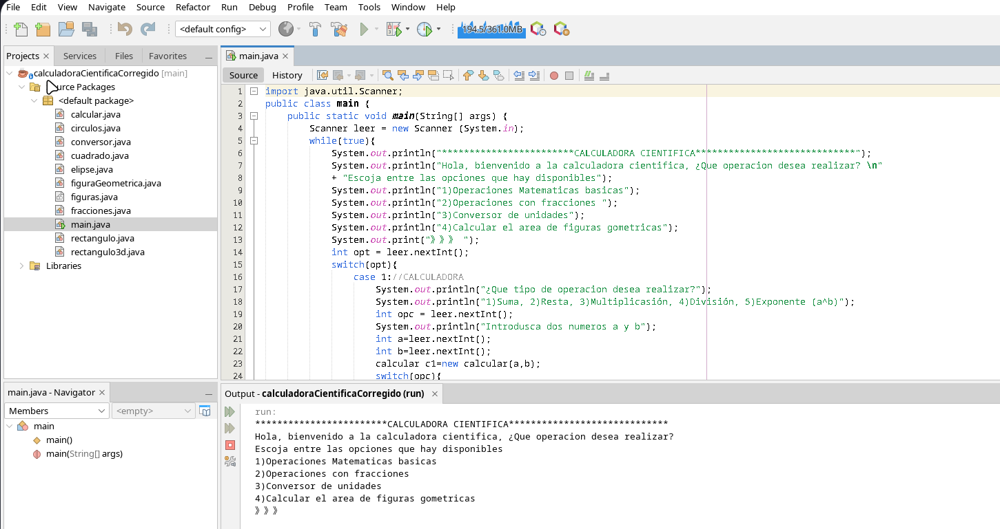

# PROGRAMACION 2 *(INF-210)*

En esta materia se uso el lenguaje de programacion java, se explico y se practico sobre la:
> herencia

> recursividad

> polimorfismo

El programa con el que se enseño esto fue ***netbeans***

### proyectos realizados el 2023 100% a mano 

